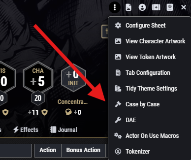
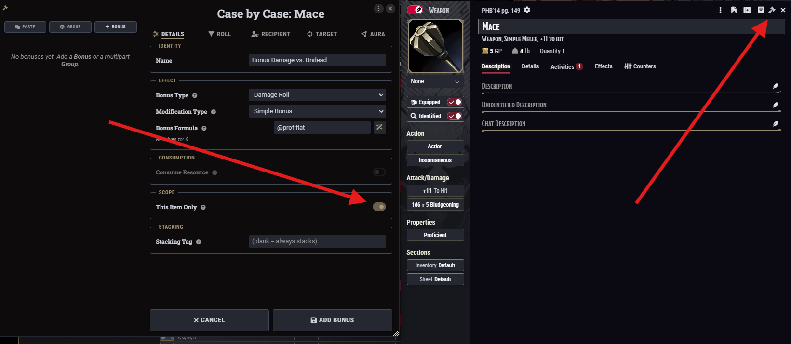
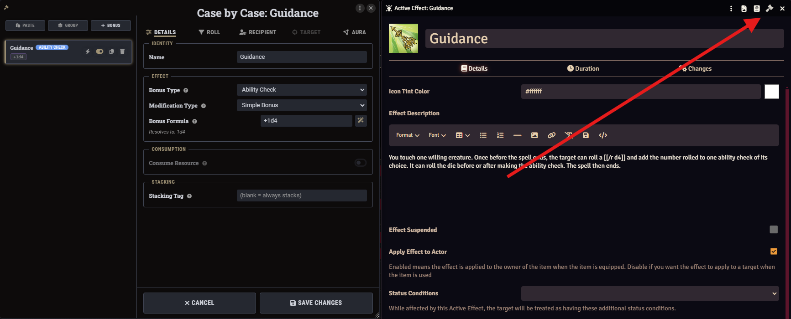
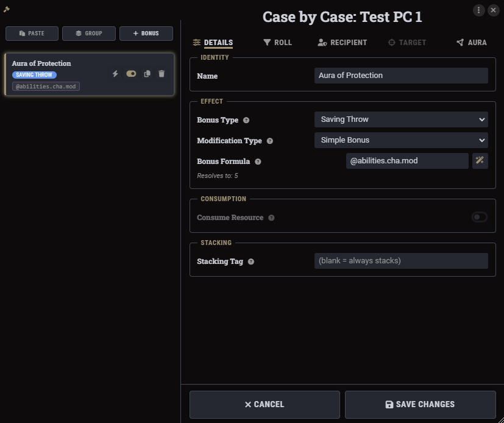
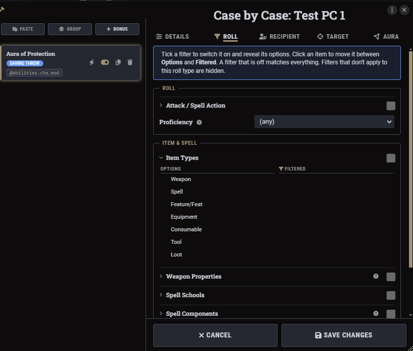
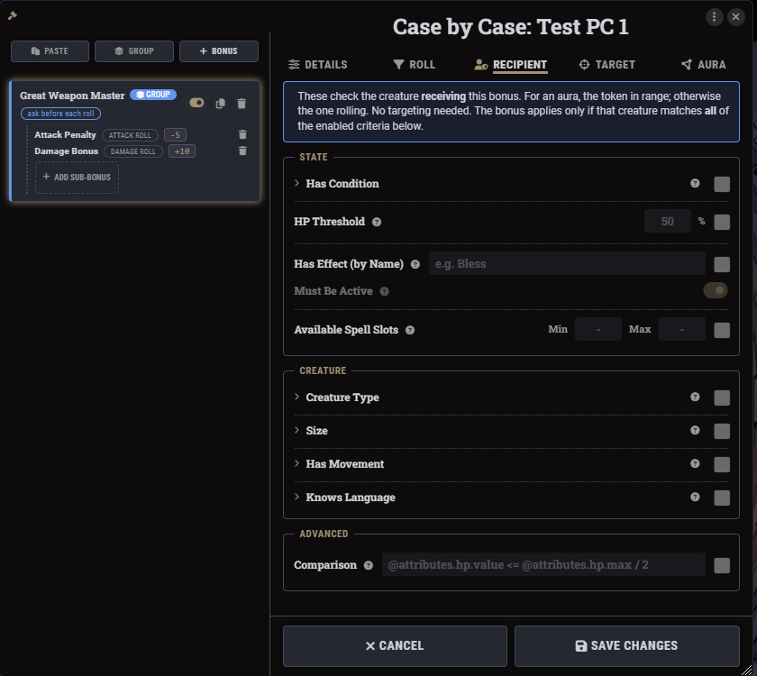
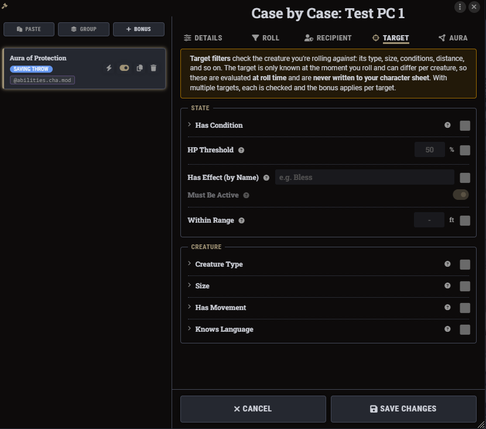
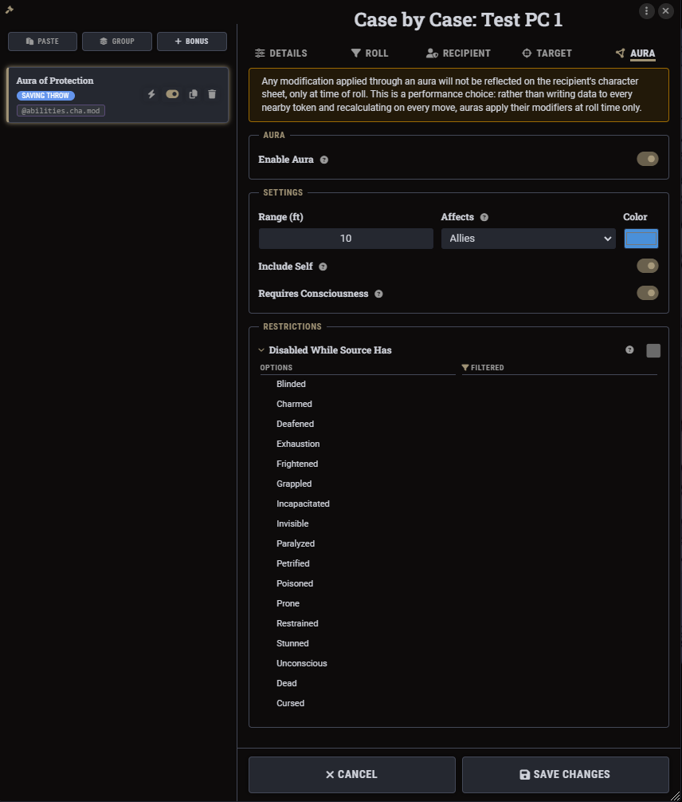
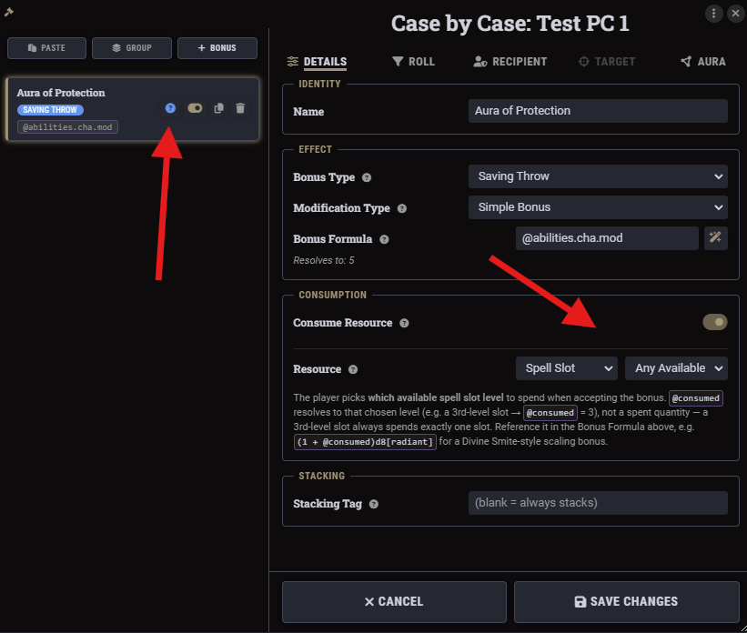
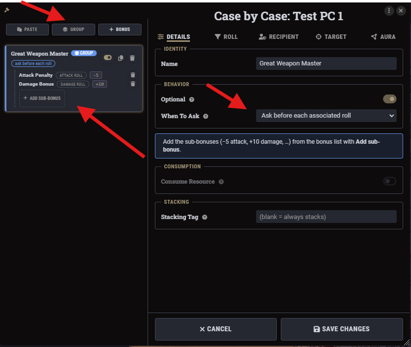

# Case by Case

A Foundry module for dnd5e that lets you build conditional bonuses and auras without touching Active Effects. Everything gets checked and applied right when a roll happens, so nothing has to be written to a token just because it walked near someone.

Heads up, I'm not a very good programmer, and a good 90% of this module was vibe coded. I've tried to keep on top of it and test things as I go, but if you run into a bug I'll do my best to fix it when I can.

This is basically a spiritual successor to Build-a-Bonus. If you're on an older Foundry/dnd5e version, or just want something more established, go check out their work instead: https://foundryvtt.com/packages/babonus

Requires lib-wrapper and midi-qol.

## Opening it up

Actor sheets, item sheets, and Active Effect configs all get a gavel icon added to their header. Click it and the Case by Case window opens for that document.

On Tidy5e sheets it shows up in the triple dot menu instead:

It works the same way from an item:

And from an Active Effect:

## The window itself

Left side is the list of bonuses on that document. Right side is the editor for whatever you've clicked on. Click a bonus in the list and it opens on the right, click a different one and it swaps over. Add Bonus and Add Group sit up top, along with Paste if you've copied a bonus from somewhere else.

## Setting up a bonus

Every bonus needs a Name and a Bonus Type (Saving Throw, Attack Roll, Damage Roll, Skill Check, and so on). Below that is the Bonus Formula, plain roll syntax like `1d4` or `@abilities.cha.mod`, with a live "resolves to" preview underneath so you can see it work out against the actual character. There's a wand button next to the formula field that drops in common scaling patterns if you don't feel like writing it by hand.

Modification Type is the dropdown right above the formula. Most bonuses just use Simple Bonus, which adds the formula as its own term. The other options (Reroll, Minimum Die Value, Maximum Die Value, Explode, Resize) change every die already in the roll instead of adding a new one. Resize for example steps every die up or down the size chain, handy for something like Great Weapon Fighting.

Consumption and Stacking sit below that, more on those further down.

## Roll filters

The Roll tab scopes a bonus down to specific circumstances about the roll itself: attack/spell action type, proficiency level, item types, weapon properties, spell schools, spell components, and so on. Click a filter's title to expand it and see its options, the checkbox on the right is what actually switches it on.

## Recipient filters

The Recipient tab checks whoever's actually getting the bonus. For an aura that's the token in range, otherwise it's just whoever's rolling, no targeting needed either way. The bonus only applies if the creature matches everything you've switched on.

## Target filters

The Target tab is the one that matters when you're rolling against something, an attack, damage, healing, that kind of thing. Same idea as Recipient but checking your actual target instead. Since the target can change roll to roll, none of this ever gets written to a sheet, it's all checked live.

## Aura

Flip Enable Aura on and the bonus projects out to nearby tokens at roll time instead of only applying to whoever it's on.

As the note in the window says: none of this touches the recipient's character sheet, it only applies at the moment of the roll. I've found that in the massive combats I run, auras tend to cause a lot of lag on movement, so these are built to be a more performant, slightly less robust alternative to what other modules provide.

If you want something more robust for a specific case, you can also use a Case by Case bonus alongside an aura from a different module. Have that module's aura apply an effect, then attach a CbC bonus to that effect. It should propagate the bonus the way you'd expect.

## Optional bonuses and spending a resource

Flip Optional on next to a bonus and instead of applying automatically, it shows up in a prompt right before the roll so you choose whether to use it. The little lightning bolt icon in the bonus list toggles this, it turns into a question mark once it's optional.

Once a bonus is optional, you can also make it cost something, a spell slot, an item use, whatever the actor has. Turn on Consume Resource, pick what it spends, and reference the amount in your formula with `@consumed`. "Any Available" lets the player choose which spell slot to burn when they accept the bonus.

Worth knowing: this prompt is separate from the normal Foundry/midi-qol roll dialog. Fast forwarding a roll with shift or ctrl, or midi-qol's auto-roll settings, won't skip it. If a bonus is optional and it applies to the roll, the prompt shows up regardless.

## Groups

A group bundles a few sub-bonuses under one shared decision, the classic example being Great Weapon Master's -5 attack / +10 damage. Hit Group to create one, then add sub-bonuses to it from the list. "When To Ask" controls the timing, before the attack roll, before the damage roll, or before each associated roll on its own.

## Stacking and item scoping

Give a bonus a Stacking Tag and any other bonus with that same tag won't stack with it, only the larger one applies. Leave it blank and it always stacks with everything.

If a bonus lives on an item, This Item Only scopes it so it doesn't also apply to other copies or other items of the same type you happen to own:

## Copying bonuses between sheets

Every bonus in the list has a copy icon. Copy one and hit Paste on another sheet's window to drop it in there too, saves rebuilding the same bonus twice.

Copy just puts a big string of text on your clipboard, it isn't tied to Foundry in any way. So you can also paste it into Discord or wherever and send a bonus to a friend, another DM, or your own other Foundry instance, and they can paste it straight into their own Case by Case window.
